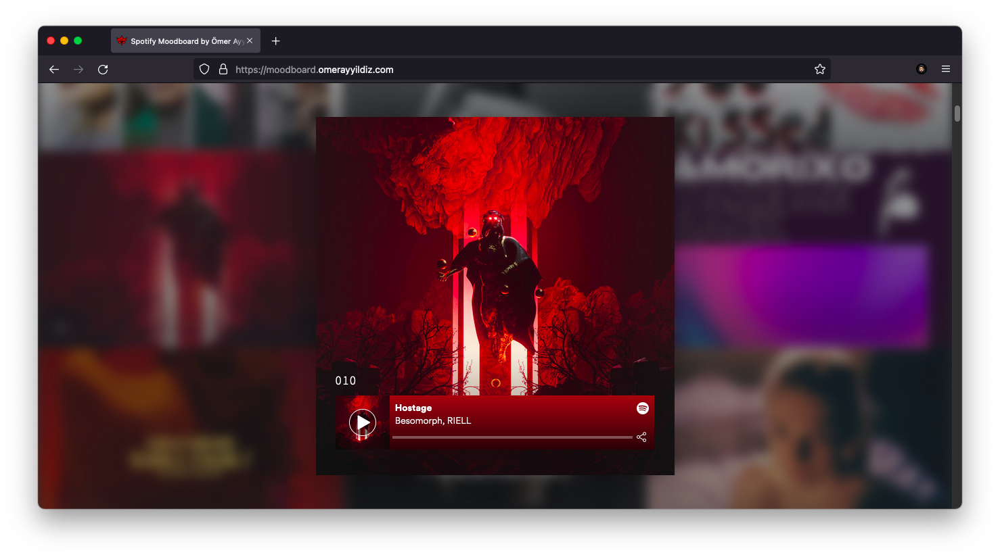

<h1 align="center">Welcome to Spotify Moodboard by Ömer Ayyıldız 👋</h1>
<p>
  
  <a href="https://twitter.com/omerayyildiz101" target="_blank">
    
  </a>
</p>

> Spotify is my inspiration. This website is my painting bag. Enjoy it :)



### 🏠 [Homepage](https://github.com/omerayyildiz/moodboard.omerayyildiz.com)

### ✨ [Demo](https://moodboard.omerayyildiz.com)

## Install

```sh
bundle install
```

## Usage

```sh
bundle exec jekyll serve
```

## Author

👤 **Ömer Ayyıldız**

* Website: https://omerayyildiz.com
* Twitter: [@omerayyildiz101](https://twitter.com/omerayyildiz101)
* Github: [@omerayyildiz](https://github.com/omerayyildiz)

## 🤝 Contributing

Contributions, issues and feature requests are welcome!<br />Feel free to check [issues page](https://github.com/omerayyildiz/moodboard.omerayyildiz.com/issues). 

## Show your support

Give a ⭐️ if this project helped you!

***
_This README was generated with ❤️ by [readme-md-generator](https://github.com/kefranabg/readme-md-generator)_